LAPORAN PRAKTIKUM 2 PEMROGRAMAN WEB
Identitas Mahasiswa

Nama : Rizky Opras Fernanda  
NIM : 312510101  
Kelas : I252A  
Program Studi : Teknik Informatika  
Mata Kuliah : Pemrograman Web  

Langkah-Langkah Praktikum
Persiapan Visual Studio Code dan Browser

Pertama, membuka aplikasi Visual Studio Code sebagai text editor dan browser untuk melihat hasil dari halaman HTML.

Kemudian dibuat folder kerja dengan nama Lab2Web.

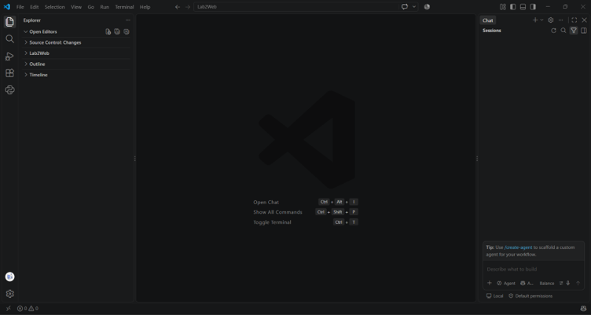
1. Membuat Tabel Data Mahasiswa

Pertama, membuat file index.html.

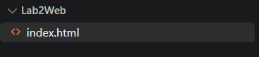

Selanjutnya membuat tabel mahasiswa.

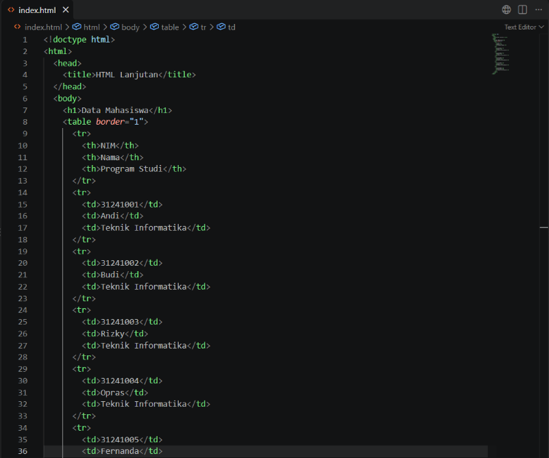

Setelah file disimpan, file index.html dibuka menggunakan browser.

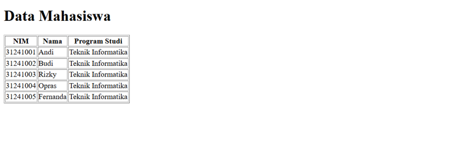
Hasil

Muncul tabel Data Mahasiswa dengan isi kolom NIM, Nama, dan Program Studi.

2. Mengembangkan Tabel dengan thead, tbody, dan tfoot

Pada tahap ini dilakukan pengembangan tabel menggunakan elemen thead, tbody, dan tfoot.

Data diubah, ditambahkan beberapa baris, serta menggunakan colspan untuk menggabungkan sel.

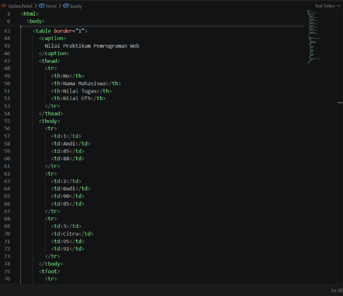
Hasil
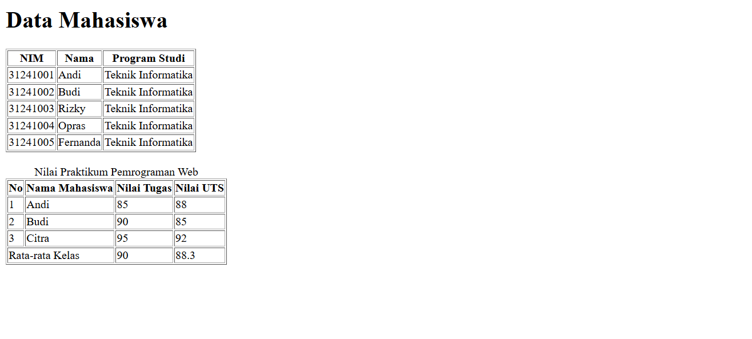
3. Membuat Form Registrasi Mahasiswa

Pada tahap ini dibuat sebuah form registrasi mahasiswa.

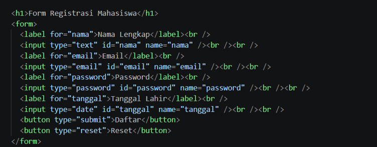 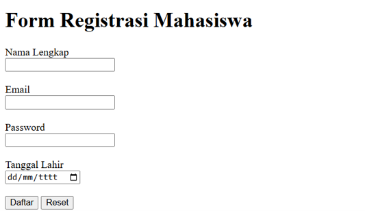
Hasil

Muncul sebuah form dengan input nama, email, password, tanggal, serta tombol Submit dan Reset.

4. Radio Button dan Checkbox

Pada tahap ini dibuat elemen Radio Button dan Checkbox.

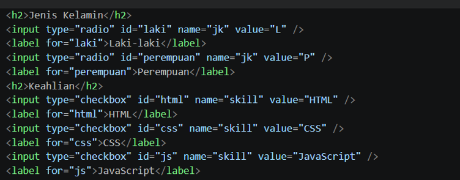 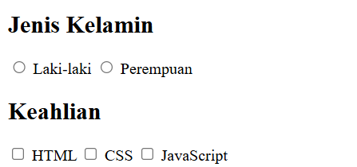
Hasil

Muncul pilihan berbentuk lingkaran untuk Radio Button dan berbentuk kotak untuk Checkbox.

5. Select dan Textarea

Pada tahap ini dibuat elemen Select dan Textarea.

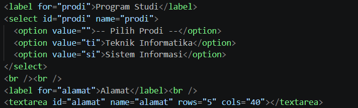 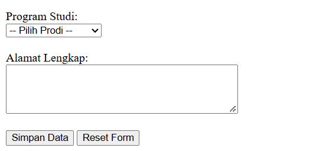
Hasil

Muncul pilihan dropdown dan kotak luas untuk memasukkan teks menggunakan Textarea.

6. Validasi Form Dasar

Pada tahap ini dilakukan validasi form dasar menggunakan atribut validasi HTML.

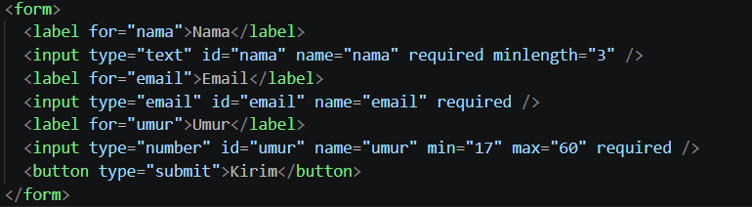 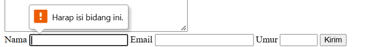

Coba tekan tombol Kirim tanpa mengisi data. Amati pesan validasi yang diberikan oleh browser.

Hasil

Akan muncul tulisan "Harap isi bidang ini" jika input yang wajib diisi dibiarkan kosong. Form harus diisi terlebih dahulu agar dapat dikirim.

7. Membuat Halaman Semantic HTML

Pada tahap ini dibuat halaman menggunakan Semantic HTML.

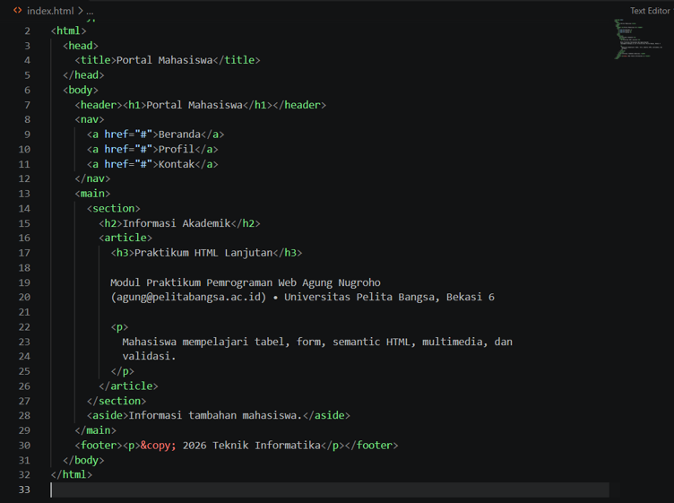
Hasil
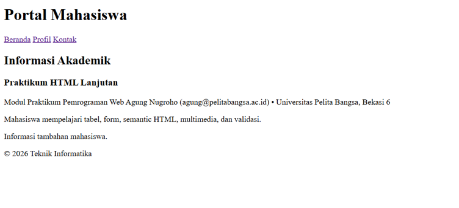
8. Menambahkan Multimedia

Pada tahap ini ditambahkan elemen multimedia berupa audio dan video.

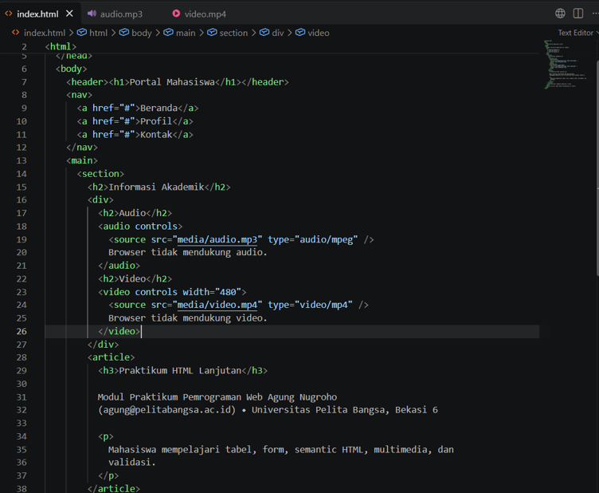
Hasil

Muncul audio dan video yang dapat diputar pada halaman web.

9. Proyek Mini — Form Biodata Mahasiswa

Pada tahap ini dibuat proyek mini berupa Form Biodata Mahasiswa.

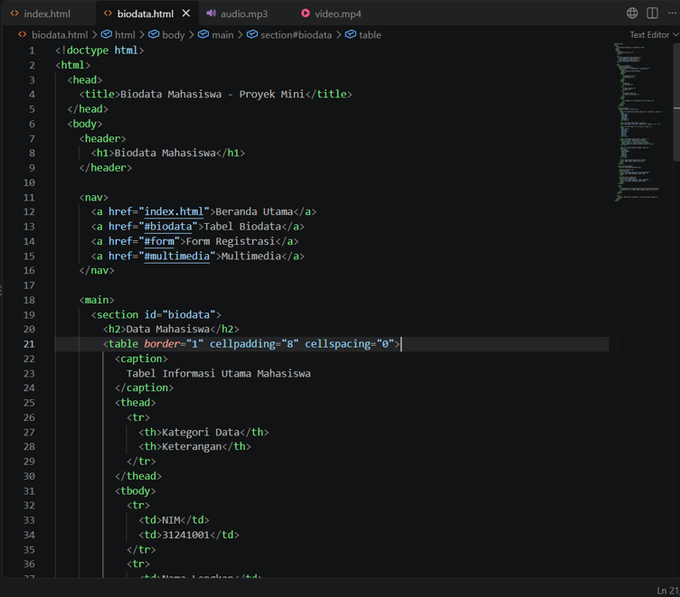
Hasil

Muncul sebuah halaman baru dengan nama Biodata Mahasiswa.

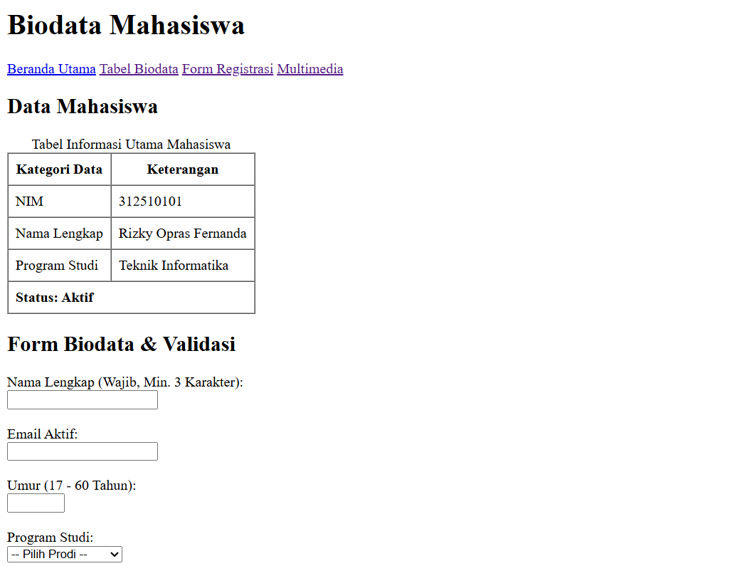 

 
 
Pertanyaan dan Jawaban HTML

Apa fungsi &lt;table&gt;, &lt;tr&gt;, &lt;th&gt;, dan &lt;td&gt;?

Berikut fungsi dari masing-masing elemen:

&lt;table&gt;: Membuat kerangka atau wadah utama tabel.

&lt;tr&gt;: Membuat baris baru di dalam tabel.

&lt;th&gt;: Membuat sel judul atau header pada tabel. Secara default, teks ditampilkan tebal dan rata tengah.

&lt;td&gt;: Membuat sel yang berisi data tabel.

Apa perbedaan &lt;th&gt; dan &lt;td&gt;?

Perbedaan &lt;th&gt; dan &lt;td&gt; adalah:

&lt;th&gt; digunakan untuk membuat sel kepala atau judul tabel (header).

&lt;td&gt; digunakan untuk membuat sel data biasa.

Secara default, teks pada &lt;th&gt; ditampilkan tebal dan rata tengah, sedangkan &lt;td&gt; ditampilkan sebagai teks normal.

Apa fungsi colspan pada tabel?

colspan berfungsi untuk menggabungkan dua atau lebih kolom dalam satu baris menjadi satu sel.

Contoh penggunaan:

&lt;td colspan="3"&gt;Data Mahasiswa&lt;/td&gt;

Kode tersebut menggabungkan tiga kolom menjadi satu sel.

Apa fungsi &lt;form&gt; dalam HTML?

&lt;form&gt; berfungsi sebagai wadah interaktif untuk menampung berbagai elemen input yang digunakan untuk menerima data dari pengguna.

Data yang dimasukkan ke dalam form dapat dikirim untuk diproses.

Apa perbedaan Radio Button dan Checkbox?

Perbedaannya adalah:

Radio Button hanya memperbolehkan pengguna memilih satu opsi dari sebuah kelompok.

Checkbox memungkinkan pengguna memilih beberapa opsi sekaligus.

Checkbox juga dapat dibiarkan tidak dipilih sama sekali.

Mengapa &lt;label&gt; sebaiknya terhubung dengan id input melalui atribut for?

&lt;label&gt; sebaiknya terhubung dengan id input melalui atribut for agar label dapat diklik untuk memfokuskan atau memilih input yang terkait.

Hal ini juga dapat meningkatkan aksesibilitas dan kemudahan penggunaan halaman web.

Contoh:

&lt;label for="nama"&gt;Nama:&lt;/label&gt;
&lt;input type="text" id="nama"&gt;

Pada contoh tersebut, for="nama" terhubung dengan id="nama".

Apa perbedaan &lt;textarea&gt; dengan input type="text"?

Perbedaannya adalah:

&lt;input type="text"&gt; digunakan untuk memasukkan teks dalam satu baris.

&lt;textarea&gt; digunakan untuk memasukkan teks dalam beberapa baris.

&lt;textarea&gt; lebih sesuai digunakan untuk memasukkan teks yang panjang.

Apa fungsi Semantic HTML seperti &lt;header&gt;, &lt;nav&gt;, &lt;main&gt;, &lt;section&gt;, &lt;article&gt;, &lt;aside&gt;, dan &lt;footer&gt;?

Semantic HTML berfungsi memberikan makna dan struktur yang jelas pada setiap bagian dokumen HTML.

Fungsi dari masing-masing elemen adalah:

&lt;header&gt;: Menentukan bagian kepala halaman.

&lt;nav&gt;: Menentukan bagian navigasi.

&lt;main&gt;: Menentukan konten utama halaman.

&lt;section&gt;: Membagi konten menjadi beberapa bagian.

&lt;article&gt;: Menentukan konten yang berdiri sendiri.

&lt;aside&gt;: Menentukan konten tambahan atau sampingan.

&lt;footer&gt;: Menentukan bagian kaki halaman.

Penggunaan Semantic HTML membuat kode lebih mudah dibaca dan membantu browser, mesin pencari (SEO), serta teknologi bantu memahami struktur halaman.

Apa fungsi required, min, max, dan minlength?

Fungsi dari masing-masing atribut adalah:

required: Memastikan input wajib diisi.

min: Menentukan nilai minimum yang diperbolehkan.

max: Menentukan nilai maksimum yang diperbolehkan.

minlength: Menentukan jumlah karakter minimum pada input teks.

Contoh:

&lt;input type="text" required minlength="5"&gt;

Kode tersebut menunjukkan bahwa input wajib diisi dan harus memiliki minimal 5 karakter.

Apa perbedaan elemen &lt;audio&gt; dan &lt;video&gt;?

Perbedaannya adalah:

&lt;audio&gt; digunakan untuk memutar berkas suara atau audio.

&lt;video&gt; digunakan untuk memutar berkas video beserta tampilan visualnya.
